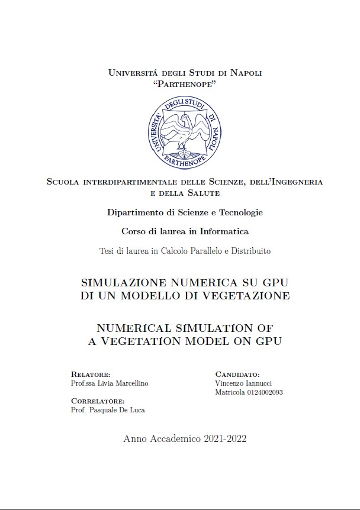

# NUMERICAL SIMULATION OF A VEGETATION MODEL ON GPU

**Author**: Vincenzo Iannucci  
**University**: Università degli Studi di Napoli "Parthenope"  
**Bachelor of**: Computer Science  
**Date**: March 27th, 2023  
**Language**: Italian

## Abstract
The purpose of the thesis is to propose a parallel scheme for the acceleration of a numerical algorithm that studies a vegetation problem in semi-arid areas,
modeled by a system of Partial Differential Equation (PDE). To do that, the proposed mathematical model and its discretization for the problem were first studied. Subsequently, a sequential algorithm that solves the problem was formulated and finally the sequential software was implemented. From the analysis of the performance of the sequential software and from the subsequent observations, a parallel algorithm was designed with a suitable parallelization strategy, which aims to simultaneously calculate the stages of the equation relating to the time discretization of the PDE. The parallel software was implemented using the CUDA environment for NVIDIA Graphics Processing Units (GPUs). Numerical experiments, showing the performance gain of the proposed strategy, are provided.
